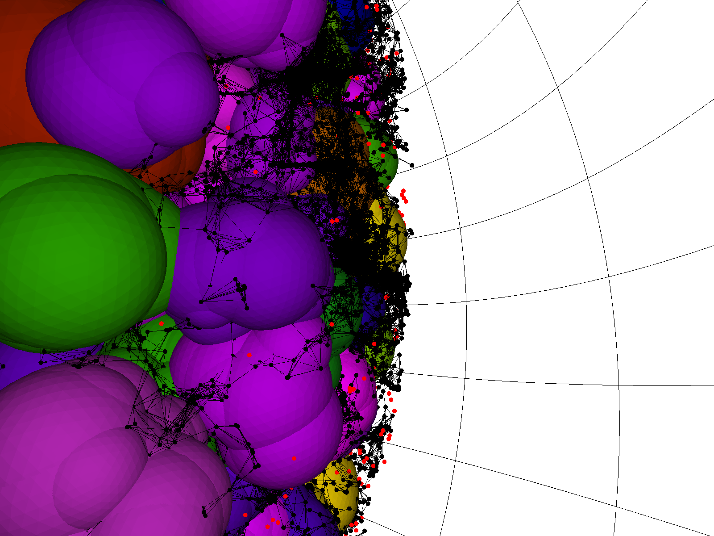
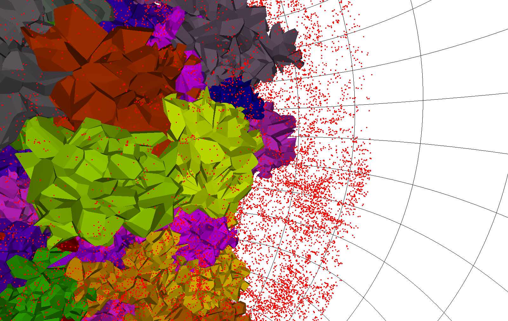

.. role:: raw-html(raw)
    :format: html

############
Introduction
############

.. _fig-vfviz:

   
   **VoidRender** visualization of the output from 
   `SDSS DR7 <https://arxiv.org/abs/0812.0649>`_.

In order to aid in assessing the quality of the VoidFinder algorithm, the 
``vast.voidfinder.viz`` package includes a **VoidRender** class 
(``from vast.voidfinder.viz import VoidRender``) which utilizes a combination of 
``OpenGL`` and the python ``vispy`` package to enable real-time 3D rendering of 
the **VoidFinder** algorithm output.  This 3D visualization allows the user to 
explore 3D space in a video-game-esque manner, where the w-a-s-d-style keyboard 
controls function to give the user a full range of motion: 
forward/backward/left/right/up/down translation and pitch/yaw/roll rotation.  
Each void hole of the **VoidFinder** output is rendered to the screen using the 
icosadehral sphere approximation, where the depth of the approximation is 
configurable and higher approximation depths yield a finer and finer grained 
triangularization of each sphere.  In addition, **VoidRender** includes an 
option to remove the interior walls of each void, which is approximated by 
removing the triangles from the triangluarization where all three vertices of a 
given triangle fall within the radius of an intersecting sphere.  This option 
aids in visually inspecting the properties of joining spheres.

The galaxy survey upon which the output voids are based may also be included 
within the visualization, where each galaxy is represented by a small dot since 
the radius of even the largest galaxy is negligibly small compared to the radius 
of the smallest void.  For visual purposes, the mouse scroll wheel may be used 
to enlarge or shrink the galaxy dot size.  By passing the appropriate portions 
of the galaxy survey to different parts of the VoidRender keyword parameters, 
wall galaxies may be displayed in black and void galaxies may be displayed in 
red.  Additionally, in order to help visualize the clustering of wall galaxies, 
another **VoidRender** option plots a thin black line between a galaxy and its K 
nearest neighbors, yielding a denser spider-web look for those galaxies which 
cluster together, as can be seen in :ref:`fig-vfviz`.

.. _fig-v2viz:

   :raw-html:`<strong>V2</strong>` visualization of the output from 
   `SDSS DR7 <https://arxiv.org/abs/0812.0649>`_.

An animated example of the **VoidRender** visualization can be found on 
[YouTube](https://www.youtube.com/watch?v=PmyoUAt4Qa8).  **VoidRender** can be 
utilized to produce screenshots or videos such as this example if a user's 
environment includes the ``ffmpeg`` library.  
:raw-html:`<strong>V2</strong>` also includes an ``OpenGL`` and 
``vispy`` based visualization for its output.  The surfaces of voids found by 
the ZOBOV algorithm are made up of convex polygons, and are rendered exactly in 
3D.  Controls for movement and production of screenshots and videos are 
identical to those of **VoidRender**.  An example of the 
:raw-html:`<strong>V2</strong>` visualization is shown in 
:ref:`fig-v2viz`.

Installation
============

**VoidRender** requires OpenGL :math:`\geq 1.2` and ``vispy`` (``pip install 
vispy``).

Also, on Ubuntu, you may need to install the following::

    sudo apt-get install mesa-common-dev libgl1-mesa-dev libgl1-mesa-dev

There is a version of **VoidRender** that corresponds to each void-finding 
algorithm implemented in **VAST**.  As a result, **VoidRender** will be built 
and installed when either **VoidFinder** or 
:raw-html:`<strong>V2</strong>` is built and installed.  Please see 
:ref:`VF-install` and/or :ref:`V2-install` for installation details.

